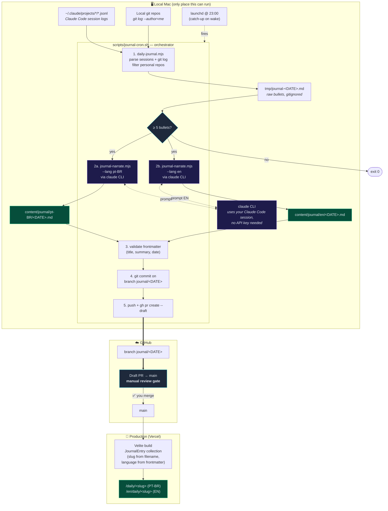
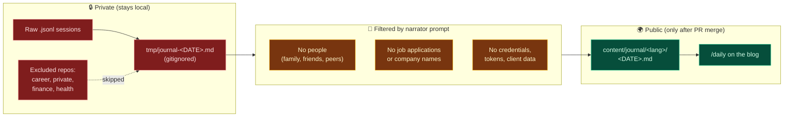

# Daily Work Journal — local automation

A local pipeline that turns each day's Claude Code sessions + git activity into
a narrated markdown entry under `content/journal/`.

## Architecture



### Why local-only?

The Claude Code session files (`~/.claude/projects/*/*.jsonl`) only exist on
your Mac. GitHub Actions / Vercel Cron can't see them — so the pipeline must
run where the data lives.

### Privacy boundaries



## What it does

`scripts/journal-cron.sh` orchestrates three steps:

1. `scripts/daily-journal.mjs` reads `~/.claude/projects/*/*.jsonl` + git log
   and writes raw bullets to `tmp/journal-<DATE>.md`.
2. If the raw file has fewer than 5 bullet lines, the run exits silently.
3. `scripts/journal-narrate.mjs` runs the local `claude` CLI (no API key
   needed) to produce `content/journal/<DATE>.md` with a single `## Diário`
   section + frontmatter (`title`, `summary`, `date`, `language: pt-BR`).
4. The result is committed on branch `journal/<DATE>`, pushed to origin, and a
   **draft PR** is opened against `main`. Nothing goes to prod until you
   approve and merge the PR.

### Privacy filter

Personal repos are excluded by default (substring match against the repo path):
`career`, `private`, `personal`, `finance`, `health`. Extend the list via env:

```bash
JOURNAL_EXCLUDE_REPOS=clientx,clienty bash scripts/journal-cron.sh
```

The narrator prompt also enforces a strict rule to omit job applications,
financial info, credentials, and other sensitive topics — but the draft PR
review is your final safety net.

The sessions live on your local Mac, so this **must** run locally. GitHub
Actions can't see them.

## Manual run

```bash
# today (America/Campo_Grande) — designed to be run at 23:00
bash scripts/journal-cron.sh

# specific day
bash scripts/journal-cron.sh 2026-05-12
```

> Narration runs through the local `claude` CLI (uses your Claude Code session),
> so **no `ANTHROPIC_API_KEY` is required**. Override the binary with
> `CLAUDE_BIN=/path/to/claude` if needed.

## Schedule with launchd (recommended on macOS)

Save as `~/Library/LaunchAgents/com.tgmarinho.journal.daily.plist`:

```xml
<?xml version="1.0" encoding="UTF-8"?>
<!DOCTYPE plist PUBLIC "-//Apple//DTD PLIST 1.0//EN"
  "http://www.apple.com/DTDs/PropertyList-1.0.dtd">
<plist version="1.0">
<dict>
  <key>Label</key>            <string>com.tgmarinho.journal.daily</string>
  <key>ProgramArguments</key>
  <array>
    <string>/bin/bash</string>
    <string>-lc</string>
    <string>cd /Users/tgmarinho/Developer/tgmarinho-ai-website &amp;&amp; bash scripts/journal-cron.sh</string>
  </array>
  <key>StartCalendarInterval</key>
  <dict>
    <key>Hour</key>    <integer>23</integer>
    <key>Minute</key>  <integer>0</integer>
  </dict>
  <key>StandardOutPath</key>  <string>/tmp/journal-cron.log</string>
  <key>StandardErrorPath</key><string>/tmp/journal-cron.log</string>
  <key>RunAtLoad</key>        <false/>
</dict>
</plist>
```

Then:

```bash
launchctl load   ~/Library/LaunchAgents/com.tgmarinho.journal.daily.plist
launchctl list | grep tgmarinho.journal      # confirm it's registered
tail -f /tmp/journal-cron.log                # watch output
```

`launchd` fires at 23:00 local time daily, covering work done since 00:00 of
the current day. If the Mac is asleep at 23:00, the job runs as soon as the
machine wakes up.

## Alternative: crontab

```bash
crontab -e
# add:
0 23 * * * cd /Users/tgmarinho/Developer/tgmarinho-ai-website && /bin/bash scripts/journal-cron.sh >> /tmp/journal-cron.log 2>&1
```

## Uninstall

```bash
launchctl unload ~/Library/LaunchAgents/com.tgmarinho.journal.daily.plist
rm           ~/Library/LaunchAgents/com.tgmarinho.journal.daily.plist
# or, for cron: crontab -e and remove the line
```
